
<h1 align="center">实习管理系统的设计与实现</h1>

## 简介
实习管理系统：角色涵盖管理员、学生、教师；支持用户注册、实习信息管理、单位和作业管理、成绩和系统公告等功能，通过直观界面提升管理效率和用户体验。    --计算机毕业设计源码；毕设源码；java毕业设计源码

## 联系方式

<h3 align="center">获取完整代码与数据库文件 + 微信：deepguan QQ: 86050149 QQ群: 783742310</h3>

<h3 align="center">可帮忙远程部署 包运行成功！提供远程部署、修改代码、设计文档指导、代码讲解等服务！</h3>

## 功能介绍（完整见运行截图）
管理员：管理员可通过角色选择登录系统，进行实习生信息管理、实习单位管理、实习记录查询和统计分析等操作，支持数据的录入与编辑，以及对实习过程中的表现和反馈进行管理。管理员还具备权限控制与安全管理能力，可以上传附件协助系统公告发布，以及运用数据可视化功能提升管理效率与决策能力。系统提供退出选项确保管理员能安全离开系统。

教师：教师可以在系统中注册并管理信息，包括填写工号、姓名、职称、联系电话和其他个人资料。教师通过登录后能进入个人中心，查看与修改学生和实习单位的信息，实现实习作业管理和评分管理。此外，教师可参与系统公告发布，以及上传、查看有关实习的各类文件。

学生：学生通过使用学号、姓名、密码等信息注册并登录系统。学生登录后，可管理个人中心的信息，方便查看与编辑个性化资料。学生能够通过系统搜索与申请实习岗位，查看已提交的实习作业信息，确认考核结果，以及上传工作证明与报告。系统为学生提供导航栏，支持个人信息查询与管理。

实习单位：实习单位可在系统中登记信息，通过登录进行实习单位的维护与管理。系统允许单位更新单位名称、性质、联系人和联系信息。单位可通过系统接受或拒绝学生申请，为学生提供岗位信息，并能与学校反馈实习生的表现及成绩。此外，单位可查看统计分析结果帮助优化实习资源配置。

## 运行截图

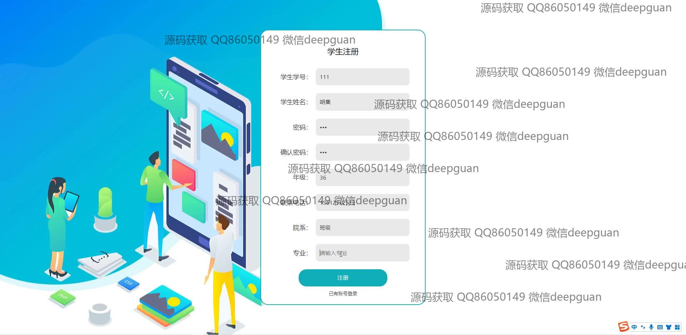
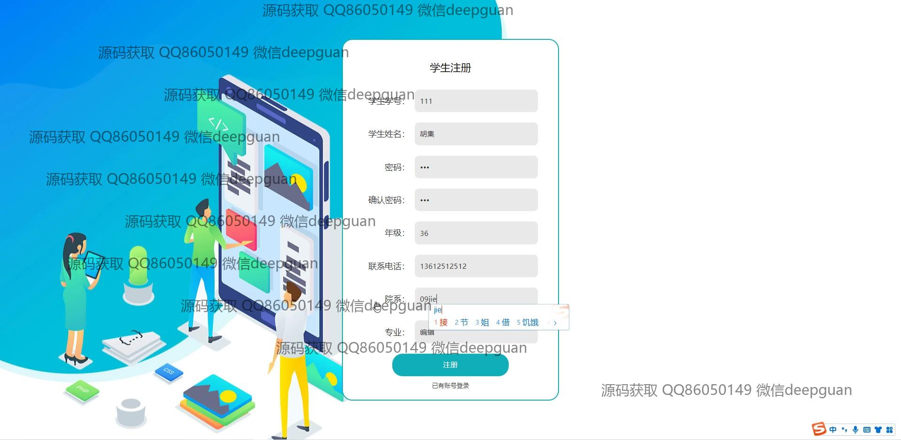
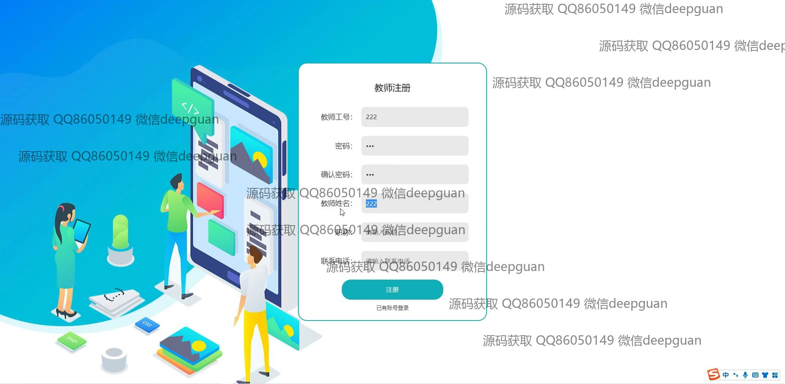
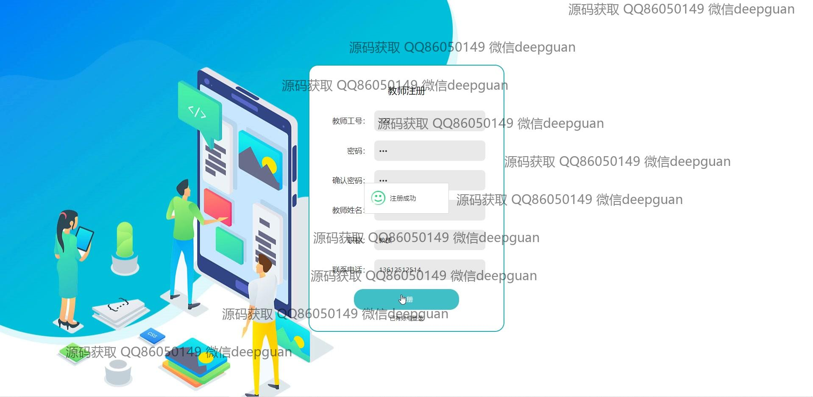
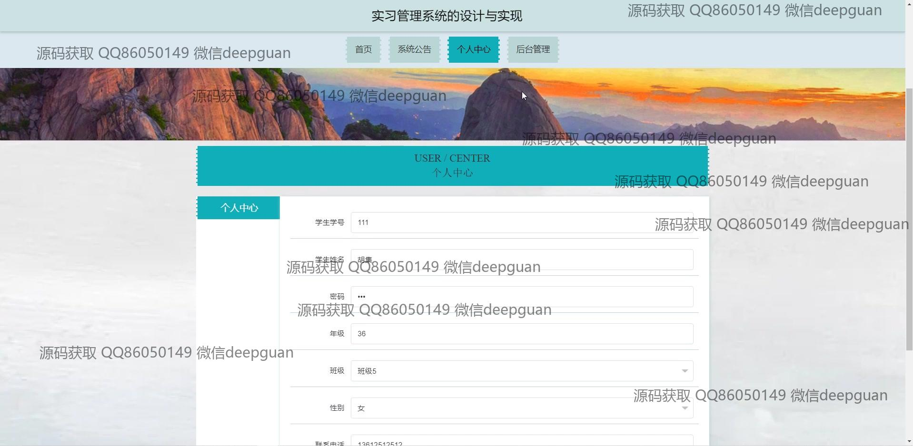

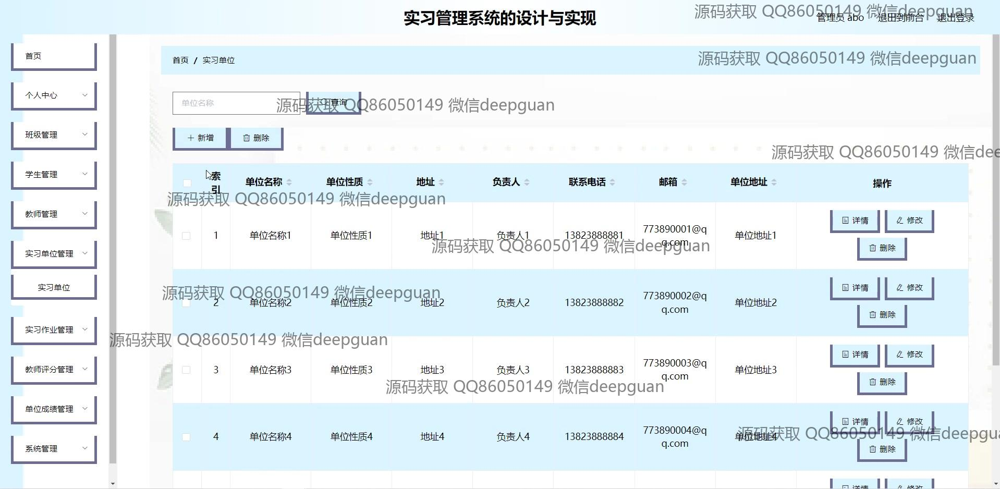
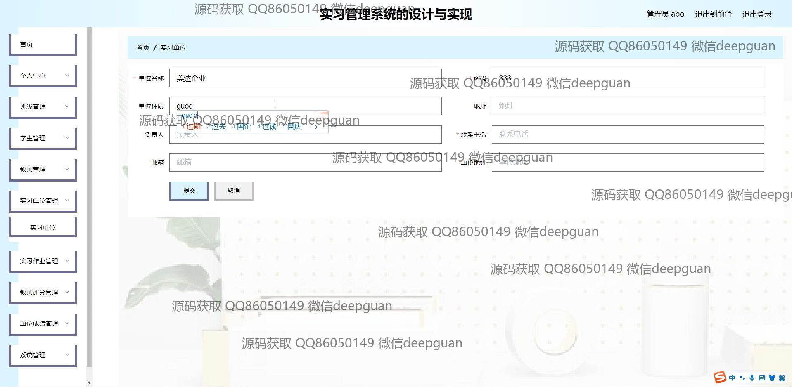

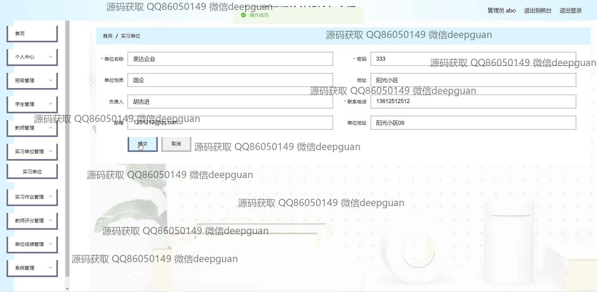
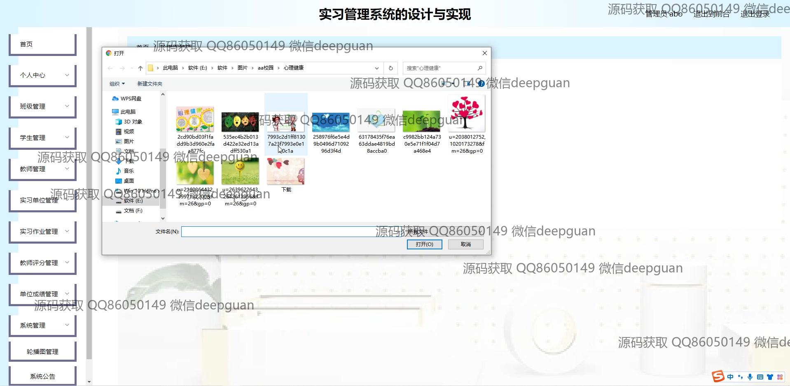
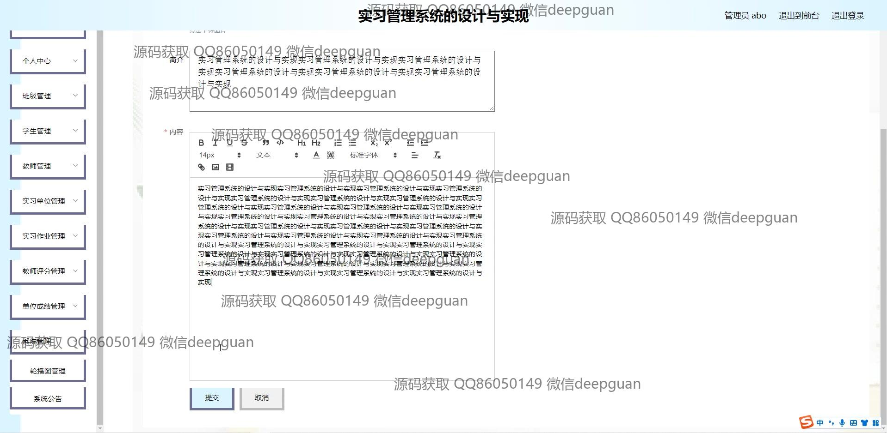
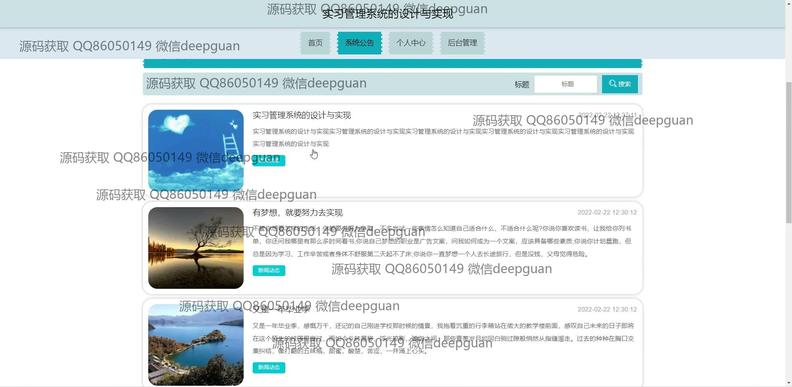
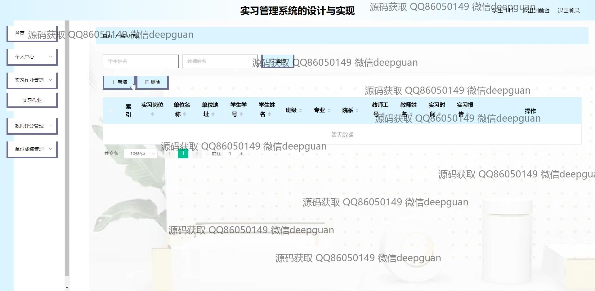
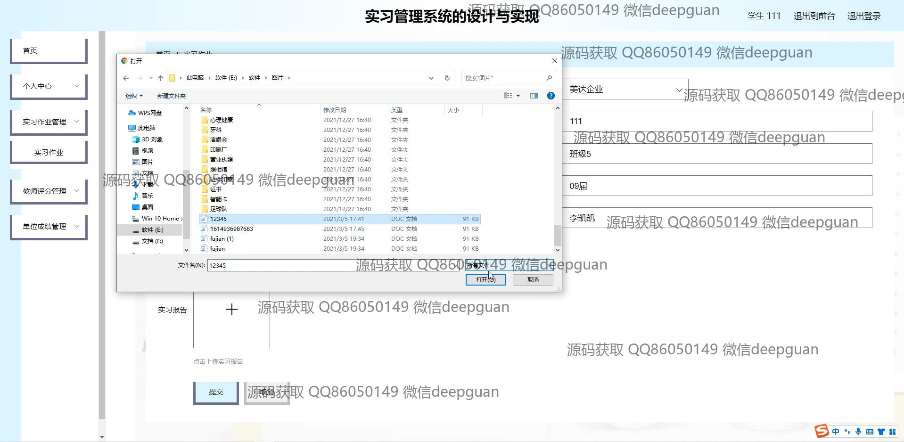
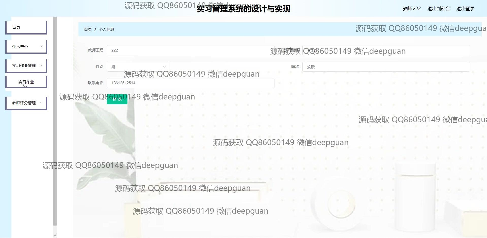
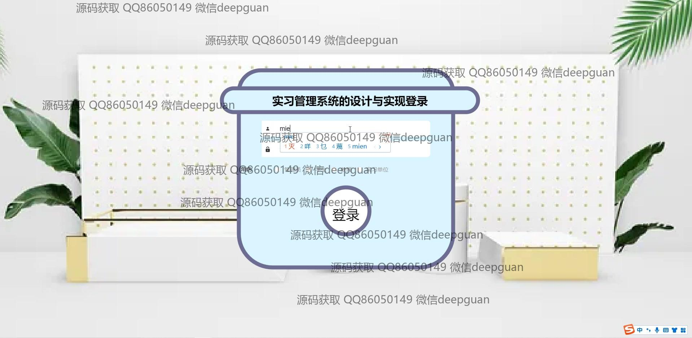
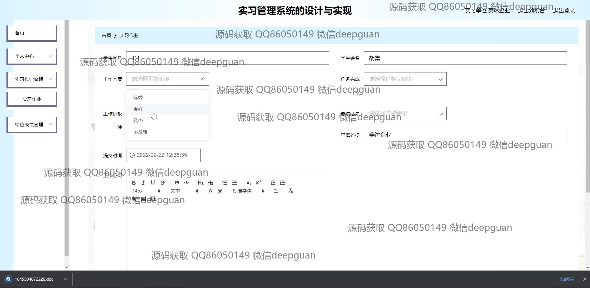
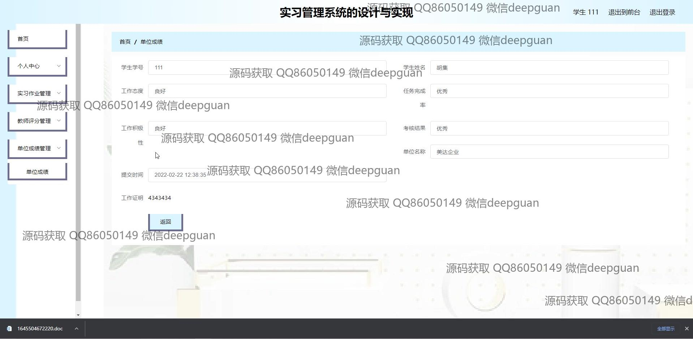

本代码来源于网络,仅供学习参考使用!

